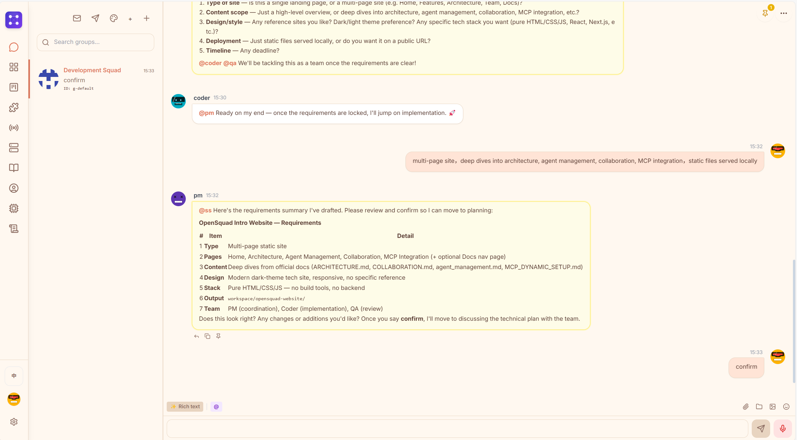
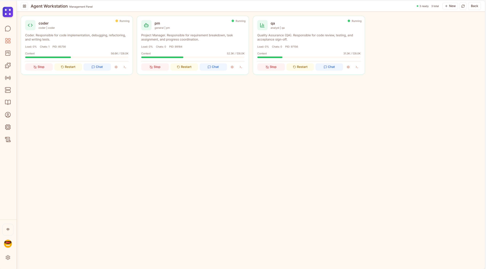
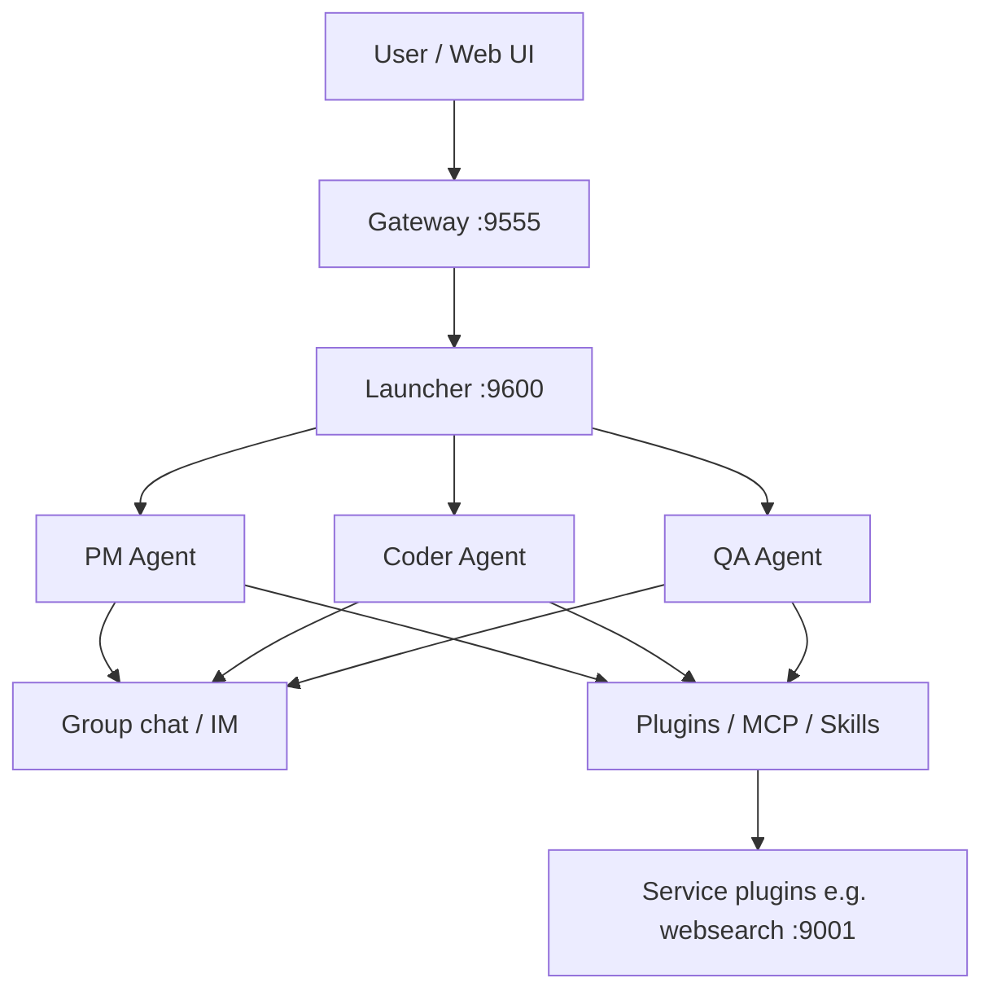

<div align="center">
  
</div>

<br>

<div align="center">
  <strong>English</strong> | <a href="README_ZH.md">中文</a>
</div>

<br>

<div align="center">

[](https://github.com/opensquad-ai/opensquad/actions/workflows/ci.yml)
[](https://github.com/opensquad-ai/opensquad/blob/main/LICENSE)
[](https://github.com/opensquad-ai/opensquad/releases)
[](https://www.python.org/downloads/)
[](https://nodejs.org/)
[](https://github.com/astral-sh/ruff)

[](https://github.com/opensquad-ai/opensquad/stargazers)
[](https://github.com/opensquad-ai/opensquad/network/members)
[](https://github.com/opensquad-ai/opensquad/issues)
[](https://github.com/opensquad-ai/opensquad/commits/main)
[](https://github.com/opensquad-ai/opensquad/blob/main/CONTRIBUTING.md)

</div>

<br>

OpenSquad is a local-first multi-agent collaboration framework. Multiple autonomous agents (PM, Coder, QA, etc.) communicate via group chat to coordinate and complete complex tasks.

---

<p align="center">
  
</p>

<p align="center">
  
</p>

---

## What is OpenSquad

OpenSquad enables multiple AI agents to collaborate like a real team. Each agent runs as an independent process with its own LLM connection, tool set, and memory. Agents communicate through group chat, coordinated by a PM agent, to tackle complex tasks that a single agent cannot handle alone.

## What Problems It Solves

A single AI agent has clear limitations when dealing with complex projects:

- **Limited context window** — Cannot handle the full context of requirements, coding, and testing simultaneously
- **Role confusion** — One agent juggling multiple roles leads to oversight
- **No parallelism** — Serial execution results in low efficiency
- **No review process** — No independent QA role for quality assurance

OpenSquad solves these through multi-agent collaboration: PM handles task decomposition and coordination, Coder focuses on implementation, QA independently verifies — each with a clear responsibility.

## Architecture (overview)



Details: [Architecture](doc_en/ARCHITECTURE.md) · [Documentation hub](docs/README.md)

## Key Features

- **Collab Card driven** — Predefined workflow templates (software dev, code review, research, etc.) with PM coordinating the team per card protocol
- **Group chat communication** — Agents collaborate via natural language group chat with @mentions, sleep/wake, and status queries
- **Independent process architecture** — Each agent runs independently, can be restarted and configured separately
- **Long-term memory** — Cross-session semantic memory system for agents to accumulate experience and knowledge
- **Interruptible sleep** — Agents can proactively sleep and wait for events, auto-waking on new messages
- **Plugin system** — 20 built-in plugins covering search, voice, version control, platform integrations, and more
- **Skill system** — Reusable task instructions defined via Markdown files
- **MCP support** — Dynamically connect external MCP servers to extend tool capabilities
- **Multi-platform access** — Web UI, Telegram, Feishu/Lark, QQ, and other interaction channels
- **Local-first** — Data and API keys stay on your machine, no third-party upload required

---

## Quick Start (about 10 minutes)

1. **Clone** this repository.
2. **Install** with `uv sync` (or `install.bat` / `install.sh`).
3. **Configure LLM**: copy a model card template and set `api_key` in `src/model_cards/` (see [model cards guide](doc_en/model_cards_guide.md)).
4. **Initialize workspace**: `uv run opensquad init` (creates `~/.opensquad/workspace` by default).
5. **Start services**: `uv run opensquad start`.
6. **Open UI**: `http://127.0.0.1:5173` (or Gateway port from `system_config`).

### Prerequisites

- Python 3.11+ (officially tested on 3.11 / 3.12 / 3.13)
- Node.js 18+ (for frontend development)
- A compatible LLM API (DeepSeek, GPT-4, Claude, Gemini, GLM, etc.)

---

### Option 1: One-Click Script (Recommended, Beginner Friendly)

**Windows**
```bash
git clone https://github.com/opensquad-ai/opensquad.git && cd opensquad && install.bat
```

**Linux / macOS**
```bash
git clone https://github.com/opensquad-ai/opensquad.git && cd opensquad && bash install.sh
```

The script automatically: checks prerequisites → installs dependencies → initializes workspace → starts all services.

> **Note**: After first start, add your LLM API key to a model card under `src/model_cards/`.

### Option 2: uv (Recommended)

[uv](https://github.com/astral-sh/uv) is a fast Python package manager. Recommended.

```bash
# Install uv (if not already)
pip install uv

# Clone the project
git clone https://github.com/opensquad-ai/opensquad.git
cd opensquad

# Install dependencies (uses uv.lock for reproducible builds)
uv sync

# Install frontend dependencies
cd src/opensquad/gateway/nexuschat-pro && npm install && cd ../../..

# Initialize and start
uv run opensquad init
uv run opensquad start
```

### Option 3: pip

```bash
git clone https://github.com/opensquad-ai/opensquad.git
cd opensquad

pip install -e .

# Install frontend dependencies
cd src/opensquad/gateway/nexuschat-pro && npm install && cd ../../..

# Initialize and start
opensquad init
opensquad start
```

### Option 4: Docker

```bash
git clone https://github.com/opensquad-ai/opensquad.git
cd opensquad

# Start (auto-builds image)
docker compose up -d

# View logs
docker compose logs -f
```

After start, visit `http://localhost:9555`. Data is persisted in Docker volumes.

Custom configuration:
```bash
# Edit config
cp src/system_config.example.json src/system_config.json
# Fill in your LLM API Key...

# Mount config and start
docker run -d \
  -p 9555:9555 -p 9600:9600 -p 9720:9720 \
  -v opensquad-data:/data \
  -v ./src/system_config.json:/app/src/system_config.json:ro \
  opensquad
```

---

## Services

`opensquad start` launches all 4 services:

| Service | Port | Description |
|---------|------|-------------|
| Gateway Backend | 9555 | FastAPI backend (WebSocket + HTTP) |
| Plugin Registry | 9720 | Plugin store API |
| Frontend Dev | 5173 | Vite React frontend |
| Launcher | 9600 | Agent process manager |

Open `http://127.0.0.1:5173` in your browser to create and configure agents via the Web UI.

---

## CLI Commands

| Command | Description |
|---------|-------------|
| `opensquad init [--workspace <path>]` | Initialize workspace (default: `~/.opensquad/workspace`) |
| `opensquad start [--port <port>]` | Start all services |
| `opensquad stop` | Stop all OpenSquad services (frontend, gateway, launcher, adapters, agent processes) |
| `opensquad status` | Show agent and service status |
| `opensquad plugin list` | List installed plugins |
| `opensquad plugin install <id>` | Install a plugin from the store or Git URL |
| `opensquad plugin uninstall <id>` | Uninstall a plugin |

Run without installing:
```bash
python -m opensquad.cli start
```

---

## Configuration

Copy `system_config.example.json` to your workspace or `src/system_config.json` (see [architecture-paths](doc_en/architecture-paths.md)):

```json
{
  "hosts": { "gateway": "127.0.0.1" },
  "ports": { "gateway": 9555, "launcher": 9600, "websearch": 9001 },
  "auth": { "node_secret": "your-secret-here" }
}
```

**Never commit** real `system_config.json`, `auth.json`, or model cards with API keys.

LLM API keys live in model cards (`src/model_cards/*.json`). Agents are created via the Web UI at runtime.

---

## Documentation

**Start here:** [Documentation hub](docs/README.md) → [Getting started (EN)](doc_en/getting_started.md)

| Document | Description |
|----------|-------------|
| [Architecture](doc_en/ARCHITECTURE.md) | System design and module map |
| [Collaboration](doc_en/COLLABORATION.md) | Multi-agent workflows |
| [Plugin ecosystem](doc_en/PLUGIN_ECOSYSTEM.md) | Built-in plugins vs Registry |
| [Contributing](CONTRIBUTING.md) | How to contribute |
| [Releasing](RELEASING.md) | Maintainer release checklist |

---

## Contributing

Issues and Pull Requests are welcome! Please read the [Contributing Guide](CONTRIBUTING.md) and [Code of Conduct](CODE_OF_CONDUCT.md) first.

---

## License

MIT License — see [LICENSE](LICENSE) for details.

*Powered by OpenSquad Core*
