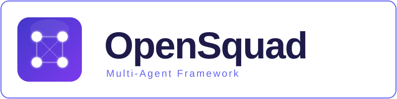
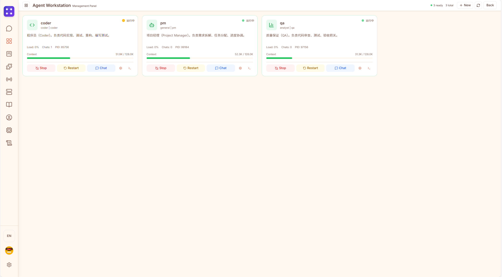
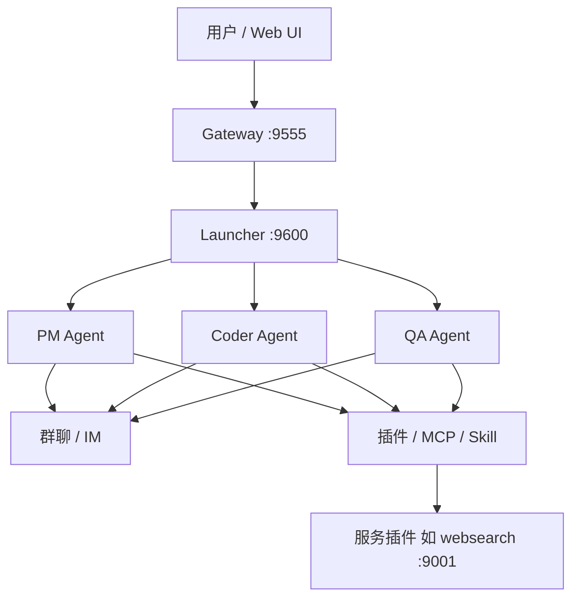

<div align="center">
  
</div>

<br>

<div align="center">
  <a href="README.md">English</a> | <strong>中文</strong>
</div>

<br>

<div align="center">

[](https://github.com/opensquad-ai/opensquad/actions/workflows/ci.yml)
[](https://github.com/opensquad-ai/opensquad/blob/main/LICENSE)
[](https://github.com/opensquad-ai/opensquad/releases)
[](https://www.python.org/downloads/)
[](https://nodejs.org/)
[](https://github.com/astral-sh/ruff)

[](https://github.com/opensquad-ai/opensquad/stargazers)
[](https://github.com/opensquad-ai/opensquad/network/members)
[](https://github.com/opensquad-ai/opensquad/issues)
[](https://github.com/opensquad-ai/opensquad/commits/main)
[](https://github.com/opensquad-ai/opensquad/blob/main/CONTRIBUTING_ZH.md)

</div>

<br>

OpenSquad 是一个本地优先的多智能体协作框架。多个自主 Agent（PM、Coder、QA 等）通过群聊通信，协调完成复杂任务。

---

<p align="center">
  
</p>

---

## 什么是 OpenSquad

OpenSquad 让多个 AI Agent 像真实团队一样协作。每个 Agent 是独立进程，拥有自己的 LLM 连接、工具集和记忆。Agent 之间通过群聊沟通，由 PM Agent 协调分工，协作完成单个 Agent 无法胜任的复杂任务。

## 解决什么问题

单个 AI Agent 在处理复杂项目时存在明显局限：

- **上下文窗口有限** — 无法同时处理需求分析、编码、测试的完整上下文
- **角色混乱** — 一个 Agent 身兼数职，容易顾此失彼
- **无法并行** — 串行执行导致效率低下
- **缺乏审查** — 没有独立的 QA 角色进行质量把关

OpenSquad 通过多 Agent 协作解决这些问题：PM 负责拆解任务和协调，Coder 专注实现，QA 独立验证，各司其职。

## 架构概览



详见：[架构说明](doc_cn/ARCHITECTURE.md) · [文档入口](docs/README.md)

## 主要特性

- **协作卡片驱动** — 预定义工作流模板（软件开发、代码评审、调研分析等），PM 按卡片协议协调团队
- **群聊通信** — Agent 通过自然语言群聊协作，支持 @提及、睡眠/唤醒、状态查询
- **独立进程架构** — 每个 Agent 独立运行，互不干扰，可独立重启和配置
- **长期记忆** — 跨会话的语义记忆系统，Agent 能积累经验和知识
- **可中断睡眠** — Agent 可主动休眠等待事件，收到消息时自动唤醒
- **插件系统** — 20 个内置插件，涵盖搜索、语音、版本控制、平台集成等
- **技能系统** — 通过 Markdown 文件定义可复用的任务指令
- **MCP 支持** — 动态接入外部 MCP 服务器扩展工具能力
- **多平台接入** — 支持 Web UI、Telegram、飞书、QQ 等多种交互方式
- **本地优先** — 数据和模型密钥留在本地，无需上传第三方

---

## 快速开始（约 10 分钟）

1. **克隆**本仓库。
2. **安装依赖**：`uv sync`（或运行 `install.bat` / `install.sh`）。
3. **配置模型**：在 `src/model_cards/` 中填写 `api_key`（见 [模型卡片指南](doc_cn/model_cards_guide.md)）。
4. **初始化工作区**：`uv run opensquad init`（默认 `~/.opensquad/workspace`）。
5. **启动服务**：`uv run opensquad start`。
6. **打开界面**：`http://127.0.0.1:5173`。

### 环境要求

- Python 3.10+（已在 3.10 / 3.11 / 3.12 / 3.13 完整测试）
- Node.js 18+（前端开发需要）
- 兼容的 LLM API（DeepSeek、GPT-4、Claude、Gemini、GLM 等）

---

### 方式一：一键脚本安装（推荐，新手友好）

**Windows**
```bash
git clone https://github.com/opensquad-ai/opensquad.git && cd opensquad && install.bat
```

**Linux / macOS**
```bash
git clone https://github.com/opensquad-ai/opensquad.git && cd opensquad && bash install.sh
```

脚本会自动完成：检查环境 → 安装依赖 → 初始化工作区 → 启动全部服务。

> **提示**：首次启动后，需在 `model_cards/` 目录下填入你的 LLM API Key。

### 方式二：uv 安装

[uv](https://github.com/astral-sh/uv) 是极速 Python 包管理器，推荐使用。

```bash
# 安装 uv（如果没有）
pip install uv

# 克隆项目
git clone https://github.com/opensquad-ai/opensquad.git
cd opensquad

# 安装依赖（自动使用 uv.lock 锁定版本）
uv sync

# 安装前端依赖
cd src/opensquad/gateway/nexuschat-pro && npm install && cd ../../..

# 初始化并启动
uv run opensquad init
uv run opensquad start
```

### 方式三：pip 安装

```bash
git clone https://github.com/opensquad-ai/opensquad.git
cd opensquad

pip install -e .
pip install -r src/opensquad/gateway/backend/requirements.txt

# 安装前端依赖
cd src/opensquad/gateway/nexuschat-pro && npm install && cd ../../..

# 初始化并启动
opensquad init
opensquad start
```

### 方式四：Docker 部署

```bash
git clone https://github.com/opensquad-ai/opensquad.git
cd opensquad

# 一键启动（自动构建镜像）
docker compose up -d

# 查看日志
docker compose logs -f
```

启动后访问 `http://localhost:9555`。数据持久化在 Docker volume 中。

自定义配置：
```bash
# 编辑配置文件
cp src/system_config.example.json src/system_config.json
# 填入你的 LLM API Key...

# 挂载配置启动
docker run -d \
  -p 9555:9555 -p 9600:9600 -p 9720:9720 \
  -v opensquad-data:/data \
  -v ./src/system_config.json:/app/src/system_config.json:ro \
  opensquad
```

---

## 启动服务

`opensquad start` 启动全部 4 个服务：

| 服务 | 端口 | 说明 |
|------|------|------|
| Gateway Backend | 9555 | FastAPI 后端（WebSocket + HTTP） |
| Plugin Registry | 9720 | 插件商店 API |
| Frontend Dev | 5173 | Vite React 前端 |
| Launcher | 9600 | Agent 进程管理器 |

启动后在浏览器打开 `http://127.0.0.1:5173`，通过 Web UI 创建和配置 Agent。

---

## CLI 命令

| 命令 | 说明 |
|------|------|
| `opensquad init [--workspace <path>]` | 初始化工作区（默认 `~/.opensquad/workspace`） |
| `opensquad start [--port <port>]` | 启动全部服务 |
| `opensquad stop` | 关闭所有 OpenSquad 服务（前端、网关、Launcher、适配器、Agent 进程） |
| `opensquad status` | 查看 Agent 和服务状态 |
| `opensquad plugin list` | 列出已安装的插件 |
| `opensquad plugin install <id>` | 从商店或 Git URL 安装插件 |
| `opensquad plugin uninstall <id>` | 卸载插件 |

无需 `pip install` 也可直接运行：
```bash
python -m opensquad.cli start
```

---

## 配置

复制 `system_config.example.json` 到工作区或 `src/system_config.json`（见 [双目录说明](doc_cn/architecture-paths.md)）。**切勿提交**含真实密钥的配置文件。

LLM API Key 在 `src/model_cards/*.json` 中配置。Agent 通过 Web UI 创建。

---

## 文档

**入口：** [文档中心](docs/README.md) → [快速开始（中文）](doc_cn/getting_started.md)

| 文档 | 说明 |
|------|------|
| [系统架构](doc_cn/ARCHITECTURE.md) | 模块与数据流 |
| [多智能体协作](doc_cn/COLLABORATION.md) | 协作机制 |
| [插件生态](doc_en/PLUGIN_ECOSYSTEM.md) | 内置插件与 Registry |
| [贡献指南](CONTRIBUTING_ZH.md) | 如何参与开发 |
| [发布流程](RELEASING.md) | 维护者发版清单 |

---

## 参与贡献

欢迎提交 Issue 和 Pull Request！请先阅读 [贡献指南](CONTRIBUTING_ZH.md) 和 [行为准则](CODE_OF_CONDUCT.md)。

---

## 许可证

MIT License — 详见 [LICENSE](LICENSE) 文件。

*Powered by OpenSquad Core*
