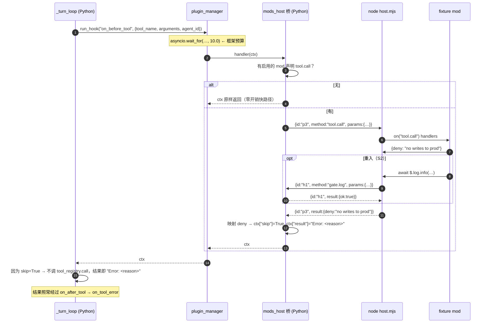

# Mods 桥 · M0 实现方案

> **状态：设计定稿，S0 动工。** 这份是 `docs/claude-code-mods-compat-v0.md`（矩阵）的运行时对应物。矩阵回答"服务什么/降级什么/拒绝什么"，本文回答"**怎么跑起来**"。
>
> **M0 的定义（验收边界）**：Node mod 宿主 + `tool.call` + 最小 `$`（`$.plugin` / `$.clock` / `$.log`），用一个 fixture mod 打通**跨进程 `{deny}`**。
> **M0 明确不含**：cordis、渲染插槽、`$.fs` / `$.process` / `$.http` 闸门的完整实现（只留一个重入探针）、TUI、热更新。

---

## 0. 摘要：桥不需要动内核

M0 需要的三个能力，仓库里**已经各有一个现成接缝**。这是整个方案的承重墙——所有设计都建立在"零核心改动"上。

| M0 需要 | 已有机制 | 位置 |
|---|---|---|
| **注入点** | `run_hook("on_before_tool", ctx)` 在 `tool_registry.call` **之前**执行，读回 `tool_name` / `arguments` / `skip`；`skip=True` 时用 `ctx["result"]` 作为工具结果 | `_runner/_turn_loop.py:611-624`、`636-638` |
| **10s 预算** | 每个 hook handler 被 `asyncio.wait_for(..., 10.0)` 包裹；超时**只记日志、链继续**，异常被吞 | `plugins/plugin_manager.py:39`、`1032-1049` |
| **自动加载** | 声明了 `hooks` 的插件**无条件加载**（"may run without an explicit tool toggle"） | `plugins/plugin_manager.py:244-266` |

三个推论，全部改变设计：

1. **桥就是一个普通插件**。它在 agent 进程内（`plugin_api.py:115-119` 的 `on_load`/`on_unload`），用 `@hook.on_before_tool` 挂上去即可——不改 `_turn_loop.py`、不改 `plugin_api.py`、不改 `run_hook`。
2. **10s 预算是框架给的**，不是桥自己造的。桥的职责是**确保自己在这个预算内返回**，并对超时后的迟到响应做丢弃；一个卡住的宿主不会拖垮整轮对话（`wait_for` 会放手），但会浪费一次工具调用——所以要在 UI 上可见。
3. **mod 的 `{deny}` 映射为 `{skip: True, result: "Error: <reason>"}`**。走 `Error:` 前缀而不是自造字段，是为了让拒绝复用既有的错误通路：`on_after_tool` → `on_tool_error`（`plugin_api.py:435`）都能一致地看到它。

### 附带修正矩阵的一处结论

矩阵 §3 把 `tool.call` 判为 `served` 但注了"我们跑在工具执行**之后**的决策点，改参数/改工具名 → 降级为拒绝"。**这个理由不成立**：hook 在 `tool_registry.call`（`_turn_loop.py:650`）**之前**，且 622-623 行把改写后的 `tool_name`/`arguments` 收回使用。

所以：**参数改写与工具改名在 OpenSquad 侧本来就是可行的**。矩阵 §3 的 `tool.call` 应从 "served（但改名/改参降级）" 升为完整的 `served`。M0 仍然只实现 `{deny}`（最小闭环），但能力面比原判断大——这是白拿的。

---

## 1. 架构：宿主放在哪

### 1.1 结论

```
┌──────────────────────────────────────────────┐
│ agent 进程 (Python, 单事件循环)                │
│                                              │
│  Plugins: mods_host                          │
│   ├─ @hook.on_before_tool ──┐                │
│   ├─ _rpc.NodeHostClient    │  marshal       │
│   └─ _node.resolve_node()   │                │
│                             ▼                │
│                    stdin/stdout (NDJSON)     │
│                             │                │
└─────────────────────────────┼────────────────┘
                              ▼
              ┌───────────────────────────────┐
              │ node host.mjs (子进程)         │
              │  ├─ readline NDJSON 循环       │
              │  ├─ runtime.mjs  on() 注册表   │
              │  ├─ $ = plugin/clock/log       │
              │  └─ mods/*.mjs  register(on)   │
              └───────────────────────────────┘
```

**宿主是 agent 进程的子进程，通道是 stdio 上的双向 NDJSON。**

### 1.2 对矩阵 §10.1 的修订

§10.1 把宿主形态定为 "**launcher 托管的 Node 服务插件**"（走 `service.cmd`）。**本文修订为 "agent 自托管的子进程"**。§8 的"以 cordis 为基座"不受影响——改的只是"跑在哪"，不是"用什么框架"。

修订的依据是两条实测前置核查（2026-10-06）：

| 原方案的风险 | 实测结论 | 改后是否仍存在 |
|---|---|---|
| `service.cmd` shell 模式能否带起 node | **能**，但有两个坑：`_sanitize_path_for_child` 会删掉含 `_internal` 的 PATH 条目（`process_manager.py:66-83`，实测确认）→ 若把 node 当打包资源放 `_internal/`，永远找不到；裸 `node` 依赖桌面 App 的 PATH，**零探测零兜底** | **消失**——不再走 shell 模式 |
| launcher 是否保证服务先于 agent | **不保证**：`launcher_main.py:1419-1421` 顺序是 agent 先起，服务在后、且在线程池里 fire-and-forget；`psp.start()` 不等端口可连，健康检查只在进程死掉时重启（`1638-1641`）→ **没有 readiness 门** | **消失**——宿主随 agent 生命周期 |
| `deny` 的跨进程方向（P0-1） | HTTP 方案下这是两个方向、两个服务、两套鉴权 | **消失**——见 §1.3 |

### 1.3 为什么是 stdio 双工，而不是本地 HTTP

`{deny}` 的裁定权在 Python 侧，而 `$.fs` / `$.process` / `$.http` 又要落回 Python 侧的闸门。于是**一次 hook 执行天然是一次嵌套往返**：

```
Python ──tool.call──▶ Node ──$.fs.read──▶ Python ──result──▶ Node ──{deny}──▶ Python
                          ▲                        │
                          └────── 同一根管道 ───────┘
```

- **HTTP 方案**：agent→host 需要一个 host 服务；host→Python 需要**另一个** Python 服务；两个方向两套端口、两套鉴权、两套超时。
- **stdio 双工**：两个方向**共用一套协议**（都是 `{id, method, params}`），"谁发起"的问题消失；重入天然成立，因为读循环从不阻塞。

附带收益：不用碰 `process_manager.py`（它的 `service.cmd` 分支经查**没有任何内置插件在用**，20 个 `plugin.json` 全是 `entry` 模式——M0 会成为该分支的第一个用户，而现在我们绕开了它），也不用碰工作区里正在改的 `_turn_loop.py` / `_tool_executor.py`。

**代价（如实记）**：失去 Service Manager 里那一行 UI 与 launcher 的崩溃自动重启；N 个 agent = N 个 node 进程。这两样等通道语义钉死后，在 M1 提升为 launcher 托管的单例服务来收回——那时 `service.cmd` 的坑也已经知道怎么绕。

### 1.4 cordis 推迟到 M0.5

mod 面向的契约是 `register(on, options)`（来自 mod 的 `hooks/hooks.json` 的 `modules`），**这层是我们自己的**；cordis 只是宿主的**内部**骨架。所以：

- **S0–S3 用一个极小的 `host/runtime.mjs` 派发器**（`on()` 注册表 + 两种派发：`emit` 与"可短路"），把通道语义钉死；
- **M0.5 再把派发器换成 cordis** 的 `ctx.on` / `waterfall`，mod 侧无感。

理由：cordis `4.0.0-rc.7` 是 RC，且 dsh 打了 **6 条本地补丁**（尤其 `fiber.ts` 的可重入销毁加固，见矩阵 §8）。第一天就上，一旦通道出问题，你分不清是自己的协议还是 RC 的 bug。**代价**：多一次内部重构。

---

## 2. 协议：NDJSON over stdio

### 2.1 帧

一行一个 JSON 对象，UTF-8，**不含内嵌换行**（`json.dumps(..., ensure_ascii=False)` 单行）。四个形状：

```jsonc
// 请求（双向同形）
{"id": "p7", "method": "tool.call", "params": {...}}

// 成功响应
{"id": "p7", "result": {...}}

// 失败响应
{"id": "p7", "error": {"code": "bad_method", "message": "..."}}

// 通知（无 id，不需要响应）
{"method": "log", "params": {...}}
```

### 2.2 id 空间

两个方向共用管道，id 必须不撞：**Python 发起用 `p<n>`，host 发起用 `h<n>`**。接收方的判定规则只有一条——

> 若 `id` 在自己的 pending 表里 → 它是**响应**；否则带 `method` 的 → 它是**请求**。

这条规则让"重入"不需要任何额外机制：读循环在处理 host 发来的请求时，自己的请求仍挂在 pending 里等回包。

### 2.3 方法表（v0）

| 方法 | 方向 | 语义 |
|---|---|---|
| `ping` | P→N | 握手探活。返回 `{pong, node, pid, api_version}` |
| `init` | P→N | 下发要加载的 mod 清单与事件订阅。返回 `{loaded, events, diagnostics}` |
| `tool.call` | P→N | `{tool_name, arguments, agent_id}` → 中间件链的 verdict：`{next:true}`（放行）/ `{deny:reason}` 等拒绝家族（见 §2.5） |
| `clock.sleep` | P→N | S0 用它测超时（也是 `$.clock` 的宿主侧实现） |
| `gate.<ns>.<member>` | N→P | **S2**。宿主替 mod 回调 Python 侧闸门，如 `gate.fs.read` |
| `log` | N→P | **S2**。宿主把 mod 的 `$.log.*` 转成宿主日志 |

`init` 的 `diagnostics` 是**矩阵 §7「加载时就报出缺口」的落点**：模块导入失败、`register` 缺失、声明了却注册不上的事件，全部在这里点名，而不是等 mod 跑到一半莫名失败。

### 2.4 超时与放弃

- **超时权威在 Python 侧**。`NodeHostClient.request(timeout=...)` 默认 8s，**低于**框架的 10s（`_HOOK_HANDLER_TIMEOUT`），留 2s 给 marshal 与日志，确保桥自己先放手，而不是被 `wait_for` 掐断。
- 超时 → 从 pending 表移除并抛 `NodeHostTimeout`。**迟到响应按 id 到达时找不到 fut，直接丢弃并记一条 warning**（不视为协议错）。
- 连续超时 > N 次 → 宿主标记为 suspect，`host_status()` 转 red（S3）。

### 2.5 面向 mod 的契约（已按权威 reference 核实，S1 起实现）

**来源**：官方 `plugins/mods/reference`（zh 版，v2.1.287 线）。三条签名，一个都不能猜：

```js
export function register(on, options)          // 恰好两个参数
on(eventName, matcher?, handler) -> { catch(handler) }
async handler($, e, next)                      // $ 第一，e 冻结载荷，next 是下游中间件
```

| 事实 | 值 |
|---|---|
| `on` 的第三参 `handler` | 不调 `next(e)` 就是**短路**（`{deny}` 之所以能拒绝，靠的就是这个） |
| `e` | **冻结**载荷；改写只能用 `next({ ...e, field })` |
| 注册对象 | 只有 `.catch(handler)` 一个方法；`.catch` 预算 1s（§1.5） |
| 日志 | `$.ui.log` / `$.telemetry.log`（**不是** `$.log`） |
| `{deny}` 家族 | `{deny}` `{refuse}` `{drop}` `{skip}` `{isOffered:false}` `{consumed}` `{isDelivered:false}` |
| 放行 | `next(e)` / `next({...e, field})` / 返回 `undefined` |
| 直出 | `{result}` `{value}` `{decision}` `{description}` `{text}` `{blocks}` `{sections}` —— **M0 不处理**，只记一条日志（deny-only 范围，不静默吞） |

**载荷展平（我们的选择，需在 M1 复核）**：`tool.call` 的 `e` 由 `{...arguments, tool, tool_name, arguments, agent_id}` 构成 —— 工具自身的参数**先展开**，规范键**后覆盖**。这样按 reference 写 `e.command` 的 guard（对 Bash 类工具）能直接工作，而名为 `tool` 的工具参数也盖不掉工具名。

**S0 的三个错误（已按此修正）**，记下来是因为它们说明"骨架能跑"不等于"契约对"：

1. `on(event, fn, mod)` → 正确是 `on(event, matcher?, handler)`；matcher 省略时才退化为两参形式。
2. 调用 handler 用 `fn(payload)` → 正确是 `fn($, e, next)`，`next` 是链路而不是返回值。
3. 提供了 `$.log` → 正确是 `$.ui.log` / `$.telemetry.log`。

派发语义因此从"遍历取第一个 verdict"改成**真正的中间件链**（handler 自己决定是否 `next`）—— 这正是 cordis `waterfall` 的语义，M0.5 换 cordis 时行为不变。

---

## 3. 生命周期与收尸

| 事件 | 动作 |
|---|---|
| 插件 `on_load()` | **不做事**（sync，不在其中拉起进程——见 §5 的守卫） |
| 第一次 async hook | 懒启动：`resolve_node_executable()` → `await asyncio.to_thread(spawn_host, ...)` → 起 reader 线程 |
| stdin 关闭 | host 收到 EOF → `process.exit(0)`（**第一条收尸路径**） |
| 插件 `on_unload()` | `close_sync()`：关 stdin → `proc.wait(grace)` → 超时 `kill()`（**第二条收尸路径**） |
| 宿主进程死亡 | reader 线程读到 EOF → 所有 pending fut 以 `NodeHostUnavailable` 失败；下一次 hook 会尝试重启 |

**双路径收尸是刻意的**：本机有过"孤儿子进程杀不掉"的教训（见项目记忆的 9555 双监听事故）。两条独立路径，任一条生效都不会留孤儿。S3 的测试会显式断言 close 之后 PID 消失。

**重启后必须重新握手**（S3 写自愈测试时抓到的第二个真 bug）：宿主重启后是一个**全新进程、一个 mod 都没加载**。所以 `init` 握手的缓存必须按**宿主代次**（`NodeHostClient.generation`）判断，而不是 client 对象身份——client 对象跨重启存活，按对象判断会跳过重握手，症状是"恢复成功，但 mod 全丢"、工具静默不生效。

### 3.1 宿主不在线时的语义（**已定：fail-open + 强制可见**）

- **fail-open**：放行工具 + 记日志 + **Mods 页标红**。理由：fail-closed 会让一个崩掉的宿主直接砖掉 agent（所有工具被拒）。
- **代价**：安全类 mod 在宿主挂掉时**静默失效**。所以"可见"不是可选项，而是这个选择的**前提**——不改 UI 就等于 fail-open 变成静默绕过。

**可见性怎么做到的**：宿主跑在 **agent 进程**里（每个 agent 一个），网关**无法探测**它，只能读 agent 留下的记录。所以每个 agent 在 `data/mods/_host/<agent_id>.json` 里留一条小记录（`state` / `pid` / `mods` / `inert` / `last_failure` / `updated_at`），由 `mods_compat.write_host_status` 写、`host_status()` 聚合：

| 情形 | 页面表现 |
|---|---|
| 正常 | "宿主运行中：N 个 agent" |
| 任一 agent 降级 | **琥珀色**："宿主已降级（fail-open：工具调用照常放行，mod 的这部分不生效）" + 最近失败原文 |
| 记录超过 **120s** 未更新 | 计入 `stale`——被杀掉的 agent 会留下记录，用时间淘汰它，而不是假装还在跑 |

**诚实边界**：这是"**最后上报状态**"，不是实时探针。真·实时（心跳 + 跨进程 liveness）留 M1。`observed` 字段的名字就是这么回事。

### 3.2 异步 handler 契约（硬约束）

**mod 的 hook handler 必须是 async 且 `$` 调用必须 `await`。** 原因：Node 是单线程，一个同步的 handler 会在等 Python 回包时阻塞整个事件循环 → **死锁**。

这是与 Claude Code 的一处**已知差异**，要写进给 mod 作者的文档：在 CC 里同步 `$` 也许能过，在这里不行。S2 会用 fixture 显式测这条。

---

## 4. deny 时序图



超时分支：`wait_for` 或桥的 8s 先到期 → handler 被放弃 → **工具照常执行**（fail-open）→ 记日志 + `host_status` 转 red。

---

## 5. 文件清单

### 新增

| 路径 | 职责 |
|---|---|
| `src/plugins/mods_host/plugin.json` | manifest；`hooks` 声明即无条件加载 |
| `src/plugins/mods_host/plugin.py` | `ModsHostPlugin`：懒启动、hook marshal、`on_unload` 收尸 |
| `src/plugins/mods_host/_node.py` | `resolve_node_executable()` + `spawn_host()`（**argv 数组、无 shell**，模块级 sync） |
| `src/plugins/mods_host/_rpc.py` | `NodeHostClient`：双向 NDJSON、id 关联、reader 线程、超时丢弃、`close_sync()` |
| `src/plugins/mods_host/host/host.mjs` | readline NDJSON 循环、`$`（plugin/clock/log）、mod loader、EOF 自杀 |
| `src/plugins/mods_host/host/runtime.mjs` | `on()` 注册表 + v0 两种派发（给 cordis 留位） |
| `tests/fixtures/mods/deny-demo/` | fixture mod（`.claude-plugin/plugin.json` + `hooks/hooks.json` + `hooks/guard.mjs`）：四个 handler 覆盖 deny / throw→`.catch` / `e.command` 展平 / 直通 |
| `tests/test_mods_host_rpc.py` | S0：帧/关联/超时/关闭无孤儿（14 用例） |
| `tests/test_mods_host_deny_e2e.py` | S1：真实 node + fixture → Python 侧真的拒绝（13 用例） |
| `scripts/mods_smoke.py` | 对已安装的真 mod 跑"闸门 / 加载 / 实际伸手"三段诊断（§9 用的就是它） |

### 改动（很小）

| 路径 | 改动 |
|---|---|
| `src/opensquad/mods_compat.py` | `load_plan()`（逐贡献加载的唯一判定处）；`write_host_status()` / `read_host_observations()` / `host_journal_path()`（§3.1 的观测 journal）；`host_status()`：`available` 改为「node 在不在」+ `scope` + `observed` + `last_failure`；`_node_hint()` 支持 `OPENSQUAD_NODE` / `OPENSQUAD_NODE_HOME` |
| `ModsManagerPage.tsx` + 两份 locale + `services/api.ts` | 常驻"实验性功能"提示（含 `host.scope`），并把过期的"宿主尚未实现"文案改对 |

### **不动**（重要）

`_runner/_turn_loop.py`、`_runner/_tool_executor.py`、`opensquad/plugin_api.py`、`launcher/process_manager.py`、`plugins/plugin_manager.py`。
后两个前正在工作区里被改（`_turn_loop.py`、`_tool_executor.py` 有未提交改动），本方案刻意避开。

### 必须遵守的既有守卫

`tests/test_async_no_blocking_calls.py` 静态禁止**在 `async def` 体内**直接调 `subprocess.Popen` / `time.sleep` / `shutil.*` 与内联 `open()`（nested `def` 与模块级 sync 函数豁免）。因此：

- `spawn_host()` 与 `open()` 一律放**模块级 sync 函数**，async 侧走 `await asyncio.to_thread(...)`；
- 无形状特例申请（不申请 allowlist 条目）。

---

## 6. 步骤与验收

| 步 | 内容 | 验收 | 量 |
|---|---|---|---|
| **S0** ✅ | node 解析 + 宿主骨架 + NDJSON 握手（`ping` / `init` / `clock.sleep` / EOF 自杀） | `pytest tests/test_mods_host_rpc.py -q` 全绿；无孤儿；`test_async_no_blocking_calls.py` 仍绿 | ½d |
| **S1** ✅ | `tool.call` → `{deny}` → Python 侧真的拒绝（**M0 的验收线**）；宿主契约对齐 §2.5 | `pytest tests/test_mods_host_deny_e2e.py -q` 全绿；fixture 的拒绝字符串（只存在于 `guard.mjs`）出现在 `Error:` 结果里；无 mod 时零开销未起进程 | 1d |
| **S2** ✅ | 重入（hook 内 `await $`）+ 8s 放弃语义 + `turn.start/complete` 上桥 | 重入往返不死锁（`test_reentrant_gate_call_inside_a_hook_does_not_deadlock`）；超时后迟到响应被丢弃不报错。**`$` 面只开了只读的 `session.cwd` / `fs.read` / `fs.exists`（4 MiB 上限 + workspace 收敛），逐 mod 授权仍是缺口** | 1d |
| **S3** ✅ | 降级 + 无孤儿 + Mods 页真实状态 | kill node → 工具仍可用（fail-open）+ **journal 可读**（`test_missing_node_fails_open_and_is_visible`）；被杀宿主**自愈并重新加载 mods**（`test_a_killed_host_is_restarted_with_its_mods`）；`on_unload` 后 PID 消失；页面显示 `observed`/`last_failure`（L8/L9） | ½d |
| **M0.5** | `runtime.mjs` 换 cordis | 同 S1/S2 测试不变绿 | — |

手工验收（S3 后）：Mods 页启用 `deny-demo` → agent 会话里调被 deny 的工具 → 看到拒绝原因 → kill node → 观察降级与 Mods 页转红。
**不需要重启网关**即可跑全部 pytest；Mods 页真机验收仍需重启网关（矩阵开发记录里的 #9）。

---

## 7. 风险与退出条件

| 风险 | 等级 | 处置 |
|---|---|---|
| 重入死锁（mod 写了同步 handler） | **高** | 契约强制 async（§3.2）+ S2 显式测试。这是与 CC 的已知差异 |
| 打包环境无 node | 中 | `resolve_node_executable()` 显式报错 + Mods 页可见。**M0 不捆绑 node**（捆绑多 50–80MB，且天然落 `_internal` 踩 PATH 清洗的坑） |
| 桥插件让每个 agent 无条件加载 → 破坏性 blast radius | 中 | `plugin.py` 顶部只许 stdlib import；无启用 mod 时 handler 是零开销快路径；S1 加断言 |
| Popen stdin 写阻塞（host 不读时） | 低 | v0 消息都很小；S2 记录实测，必要时改 asyncio writer |
| cordis RC 的 6 条已知坑 | 中 | 已被 M0.5 隔离 |

**kill criteria（沿用项目决策）**：M2 时随机抽 10 个市场 mod，跑得起来 **< 3 个就停**整个 initiative。

---

## 8. 未决项（阻塞点标注）

1. **fail-open vs fail-closed**（§3.1）——**S3 之前必须定**。建议 fail-open。
2. **参数改写是否进 M0**——能力已确认可行（§0），但为保持最小闭环，M0 只做 `{deny}`。建议 M1 再开。
3. **`init` 的 mod 清单来源**——复用已有的 `mods_compat.discover_mods` + `read_mod_state`（`data/mods/<name>/state.json` 的启用意图），不再造第二套。
4. **`$.store` / `$.state` 的落盘位置**——`data/plugins/mods_host/store/<mod>/`，M1 议。

---

## 9. 真实第三方 mod 的实测（2026-10-06）

**方法**：从两个真实市场（`DarioFontanel/claude-code-mods`、`danyuchn/claude-mods`）按 commit 钉住、**逐字**安装 5 个 mod 到 `<workspace>/mods`（provenance 记在同目录 `_PROVENANCE.json`），用 `scripts/mods_smoke.py` 跑。没有转译、没有打补丁。

| mod | 语言 | 扫描裁定 | 因何被拒 | 真实加载器 | register | tool.call 被调用 | 缺失的 `$` |
|---|---|---|---|---|---|---|---|
| `replay-theater` | mjs | blocked | 事件 `ui.close` + `$.ui.close` | skip | 8 handler | **4 次** | `$.session.cwd` ×3 |
| `quick-buttons` | js | blocked | `$.ui.close` | skip | 3 handler | 0 | — |
| `cache-meter` | js | blocked | 事件 `turn.step` | skip | 2 handler | 0 | — |
| `cache-panel` | tsx | blocked | TypeScript 模块 | skip | — | — | — |
| `next-steps` | tsx | blocked | TypeScript 模块 | skip | — | — | — |

**三条结论，一条比一条重要**：

1. **5/5 被判 blocked → 真实加载器一个都不加载。** 这不是 bug，是矩阵按设计工作（缺口点名）。但结果是：**"吃 mods 生态红利"目前等于 0 个真 mod。**
2. **生态重心恰好是我们 v0 拒绝的两类**：5 个里 3 个是 TS/TSX，4 个用 `ui.render`。真 mod 是**UI mod**（面板、按钮、提示条），而 v0 只开了 `tool.call` 一条路 + 明确关掉输入接管与渲染的绝大部分。另：真 mod 还 `import { atom } from 'claude-code'`（第 5 家的 SDK 包）——**依赖面比 reference 文档写的更大**，M1 评估时必须重跑矩阵。
3. **"加载 ≠ 生效"，且 handler 抛异常数不是有效指标。** 唯一用到 `tool.call` 的 `replay-theater` **确实被调用了 4 次**（3 个 Edit 系工具进了分支，第 4 个 Bash 不匹配 `EDIT_TOOLS`）；它第一次伸手 `$.session.cwd` 就拿不到，然后**被它自己的 `catch {}` 吞掉**（源码注释："recording must never stop the edit"），工具照常执行。**安全，但完全无效果**。这也是为什么宿主必须支持 `OPENSQUAD_MODS_HOST_TRACE=1`：只有追踪 `$` 的实际伸手，才能区分"没跑"和"跑了但无事发生"。（追踪粒度限制：每条路径只记录**第一个**缺失成员，因为第一次缺失就抛了。）

**已决定并落地：逐贡献加载**（2026-10-06）。原先"blocked → 整个 mod 不加载"，一个 UI 成员就能让整个 mod 归零。现在改为：**被拒的贡献天然惰性**——我们从不 emit 它的事件，也从不提供它的 `$` 成员，所以拒绝它只让该 mod 失去**那一部分**贡献，而不是全部。安全属性来自"不实现"，不是"过滤"，因此不需要任何运行时拦截。

判定收敛到 `mods_compat.load_plan(info)` 一处（loader 与页面共用，缺口理由同一套）；唯一仍然致命的是"没有任何可加载模块"（TypeScript 源码）。

复测结果（同一批 5 个真 mod，`scripts/mods_smoke.py`）：

| mod | 裁定 | 加载 | 惰性贡献 | handlers | tool.call | **gate 调用成功** | 缺失 `$` |
|---|---|---|---|---|---|---|---|
| `replay-theater` | blocked | **yes** | `ui.close`, `$.ui.close` | 8 | 4 | **session.cwd×3, fs.exists×1, fs.read×1** | **0** |
| `quick-buttons` | blocked | **yes** | `$.ui.close` | 3 | 0 | 0 | 0 |
| `cache-meter` | blocked | **yes** | `turn.step` | 2 | 0 | 0 | 0 |
| `cache-panel` / `next-steps` | blocked | no（TS） | — | — | — | — | — |

**从 0/5 变成 3/5 可加载**，而且 `replay-theater` 的**记录路径真的跑通了**：`session.cwd×3` 恰好对应 3 个 Edit 系工具各调用一次 `stepsFor` 的头部，`fs.exists`+`fs.read` 各 1 次只出现在 `Write` 分支，`turn.start`/`turn.complete` 各 1 次把 `pending` 提交成 `replay`——**计数与源码逐条对得上**，且缺失 `$` 归零。剩下惰性的只有渲染（`$.ui.invalidate`、pane 绘制）。

**这次复测抓到一个真 bug，值得记下来**：重入第一版**完全不通**——`tool.call` 每次 8 秒超时。原因是 `_rpc._on_frame` 的判序错了：先判"id 不在 pending 表 → 当作迟到响应丢弃"，而宿主发来的**请求**用的 id 来自另一个 id 空间（`h<n>`），必然不在 pending 表里 → **所有重入请求都被当成迟到响应丢掉**。正确判序是"有 `method` → 请求"优先于"未知 id → 迟到"。这正是 S2 存在的理由：这个洞只有真 mod 真的回调时才暴露。现已由 `test_inbound_request_is_served_not_mistaken_for_a_stale_reply` 钉住。

---

## 10. 其余缺口的"通用性"盘点（2026-10-06）

问的是：除了渲染，其他缺口是不是通用能力（修一次多个 mod 受益）？**是，几乎全部通用**——但"通用"不足以决定该修哪个。

| 缺口 | 通用？ | 成本 | 能翻转哪个真 mod |
|---|---|---|---|
| **渲染插槽**（`ui.render` + `$.ui.open/...`） | ✅ | **大**（2–4 周，无安全阻碍） | replay-theater / quick-buttons / cache-meter（3/5） |
| **TypeScript 转译** | ✅ | 中（esbuild + `.ts` 扩展名导入 loader + 构建步骤的信任问题） | cache-panel / next-steps（2/5，但它们也是 UI mod → 仍看不见） |
| **`$.command.{register,list,run}`** | ✅ | **中偏大，且三表面**：Python 静态表 + 650 行 CLI dispatch + **Agent Web 前端硬编码的 3 条且无后端端点** + `{text}` 输出通道 | **replay-theater 的 `/replay` 能出文本，不需要渲染** |
| **`turn.step`** | ✅ | 中（要把 turn loop 的逐 step 暴露出来） | cache-meter 的 tick |
| `session.start` / `session.end` | ✅ | 中（要新增生命周期钩子：11 个 hook 名里没有它） | 3/5 的初始化 |
| `$.session.{id,model,turns,usage}` | ✅ | 中（`Context` 只有 `agent_id/project_root/event_bus/config/data_dir/plugin_dir`，**没有 session 事实** → 需要 runner→插件的管道） | 无（单靠它不行） |
| `$.store.*` | ✅ | **小** | ❌ 单靠它不行（但 quick-buttons 需要） |
| `$.state.*` | ✅ | 小 | ❌ 无当前消费者（用它的都是 TS mod） |
| `$.fs.{list,stat}` | ✅ | 小 | ❌ 无当前消费者 |
| `$.fs.write` / `$.process.run` / `$.http.fetch` / `$.env.set` | ✅ | 小–中 | 需要**逐 mod 授权**（矩阵 §7），即先有信任分级 |
| `ui.close` / `$.ui.close` | ❌ 安全项（铁律 2） | — | 逐贡献加载下已是惰性，不必修 |

**结论（重要）**：**通用 ≠ 值得现在修。** 上面那些"小"的通用项（store / state / fs.list / session 事实）**一个都翻转不了真 mod**——因为 4/5 是 UI mod，最后一步都卡在渲染。真正能翻转的只有三项，而它们**全是中等或大工程，其中两项还是多表面**（Python + CLI + Agent Web / TS 镜像）。

**本轮的取舍**：只做了两件"通用且必须有"的：
1. **`$.store.{get,set,delete,keys}`** —— 4 MiB/ mod 上限、按**目录名**隔离（宿主给每次闸门调用盖上 `_mod`，mod 无法访问别人的命名空间）。这是唯一有**真实消费者**的通用项（quick-buttons 靠它记住用户选的按钮）。
2. **补上 11 条 `degraded` 的空理由** —— `degraded` 的定义就是"能跑但有差异"，不写差异等于没说；页面原来只显示"降级（行为有差异）"。`$.ui.toast` 现在明确写着"只写入宿主日志，不弹提示 —— mod 不报错，但用户看不到"。并加了两条**矩阵自洽的不变量测试**：degraded 必须有理由；我们发布的成员不得被判 refused。

`$` 面因此从 14 → **18 个成员**。

---

## 11. 打开渲染：mod 侧契约（2026-10-06，已落地）

### 11.1 真实契约（读真 mod 源码才发现，矩阵写错了）

真 mod 的元素构造器**不是自己 import 的**，是宿主给的：

```js
on('ui.render', { component: 'AbovePrompt' }, ($, e) => {
  const { Box, Text, Button } = $.ui.resolve(e)   // ← 元素工厂从这来
  return Box({ flexDirection: 'row', children: [Text({ bold: true, children: 'hi' })] })
})
```

所以 `$.ui.resolve` 不是矩阵里写的"解析一个 key 到节点"，而是**元素工厂的来源**（矩阵理由已更正）。这一条改变了整个实现路径：**不需要给 mod 发 SDK 包**，宿主自己造元素即可。

`Button({ onPress })` 里的 `onPress` 是函数、**过不了进程边界**——这正是铁律 2 的落点：宿主把它收下、换成 `action` id 塞进树里（`action.invoke` 再回调）。

### 11.2 已落地的三块

| 块 | 内容 |
|---|---|
| **元素工厂**（host） | `$.ui.resolve(e)` 给 `Text / Box / Markdown / Code / Button`；每个工厂返回**可序列化节点** `{type, props, children}`；`Button.onPress` 提升为 action id 并寄存；`$.ui.invalidate` 可调用并计数 |
| **树校验**（Python，铁律 3） | `mods_compat.validate_element_tree`：元素白名单 + 属性白名单 + **节点数 200 / 深度 12 / 文本 10k** 硬上限；`Client/Input/Select/Svg/Raster/Image` 明确拒绝**并给出理由**；超出白名单的元素/属性**丢弃并记诊断**（照 dsh 的宽松策略，不让一个野属性白掉整块界面） |
| **取树**（Python） | `plugin.render_slot("AbovePrompt")` → 宿主 `ui.render`（**collect 模式**：每个 mod 各画自己那行，不是链式短路）→ 校验 → 返回 `{nodes, dropped, invalidations}`；`invoke_action(id)` 走 `action.invoke` |

### 11.3 实测证据

`cache-meter`（真第三方 mod）现在**真的产出了一个通过校验的节点**：

```
render : AbovePrompt → 1 node(s) [Text]      invoked=ui.render×1      missing $ = 0
```

`replay-theater` 也被调用了 `ui.render×1` 但返回 0 个节点——因为它的 band 只在 `state.isOpen && state.inBand` 时画（要先跑 `/replay`）。**这是它自己的状态为空，不是桥的问题**——这条区分很重要。

### 11.4 最后一跳 —— **已做（M1 的 P1）**

链路是 **mod → host → Python agent → gateway → 浏览器**，五跳全部打通（见 `docs/mods-bridge-m1-plan.md`）：

- **gateway 确实不用改**（当时的预判对了）：不在 `_RELAY_HANDLER_METHODS` 里的 topic 是 plain relay，按自己的 WS 类型原样转发；前端 `aiWebSocket.ts` 也按 `msg.type` 查表。**唯一的协议动作是登记 relay topic** —— 而且它不是一处而是**三处**（`EVENT_TYPES` / `GENERIC_RELAY_TOPICS` / `AGENT_OUTPUT_BROADCAST_TYPES`），由 `tests/test_ws_event_contract.py` 钉住，漏一处就是"帧静默消失"那类老事故。
  **收尾时把这条链路读到了行号**（因为前三个 bug 都出在这一带）：agent 消息循环只有一条放行门 —— `ai_web/websocket.py:381 elif msg_type in _AGENT_OUTPUT_DISPATCH_TYPES:`，而契约测试断言 `DISPATCH == BROADCAST | {"turn_cancelled"}` → `mod_slot`/`mod_commands` 都在里面（已实测两个集合都 True），所以必然进这一支；进支后 `if user_id: … or msg_type in _AGENT_OUTPUT_BROADCAST_TYPES:` → `broadcast_to_agent`，而它是 `ws.send_json(message)` **原样**。**有 `user_id` 与否都走广播**，不存在"因为带了 user_id 就被改成定向推送、别的 pane 收不到"这种岔路。
- **前端加了**：`ModSlotHost`（挂在输入区上方）+ `ModElement`（5 个白名单元素的渲染器）+ 按钮 press → 经网关通用命令通道 → adapter → 总线 → 宿主 `action.invoke`。
- 实做时多出三条**当时没预见到**的要点：①插件发给总线的必须是**信封** `{"sid","data",...}`（裸 payload 会丢 sid、被路由到焦点 pane）；②pane 帧要按**工作区级**存（pane shell 没有会话）；③**信封的 `data` 到浏览器时改叫 `content`**——adapter 的 `_unwrap` 拆掉信封、`send_response` 把 payload 放进 `content`，网关再**原样** `ws.send_json(message)` 转发，前端不归一化。所以前端处理器必须读 `msg.content ?? msg.data`（仓库里除了 `agent_ready_stage` 全都这么读）。只读 `msg.data` 会拿到 undefined → 零节点 → 横幅**永远空**且日志里一个字都没有。
  **这一条有三个坑面，都踩了**：（a）前端读错键；（b）`_unwrap` 要求 `sid` 与 `data` **同时存在**才拆信封——少了 `sid` 的裸 `{"data":…}` 会原样透传，到前端就深了一层（`mod_commands` 的菜单因此空掉）；（c）无会话的 agent 级帧（如 `mod_commands`）用 `"sid": ""` 仍然算"有 sid"，能正常被拆。现在插件里 3 处 `bus.emit` 都已核对，两侧各有测试钉住。

---

## 附：证据来源

| 事实面 | 位置 |
|---|---|
| hook 注入点与 `skip` 语义 | `src/opensquad/_runner/_turn_loop.py:611-638` |
| 10s 预算 / 异常吞掉 / 声明 hooks 即加载 | `src/plugins/plugin_manager.py:39`、`1032-1049`、`244-266` |
| 插件进程内生命周期 | `src/opensquad/plugin_api.py:97-125` |
| `service.cmd` shell 分支与 PATH 清洗 | `src/opensquad/launcher/process_manager.py:1284-1287`、`66-83`、`1339-1366` |
| launcher 启动顺序与无 readiness 门 | `src/opensquad/launcher_main.py:1419-1421`、`1118-1137`；`process_manager.py:1615-1666` |
| 桌面 App 不再传 `--no-services` | `gateway/nexuschat-pro/electron/main.ts:673-683`、`526-551` |
| 异步阻塞守卫 | `tests/test_async_no_blocking_calls.py:38-119`、`273-278` |
| 矩阵（裁定与限额） | `docs/claude-code-mods-compat-v0.md` |
